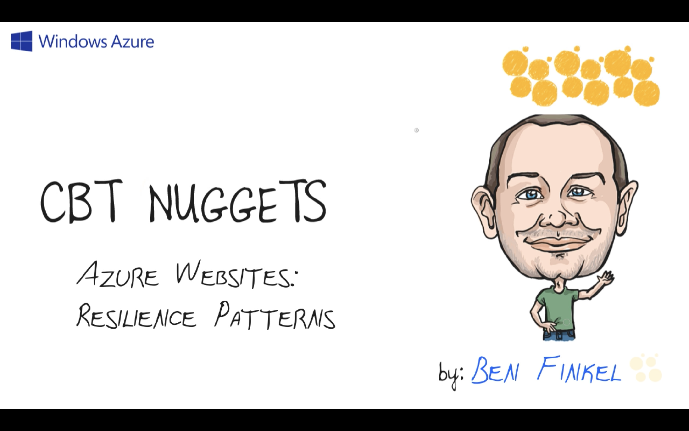
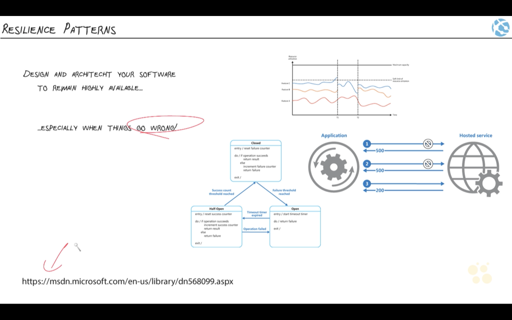
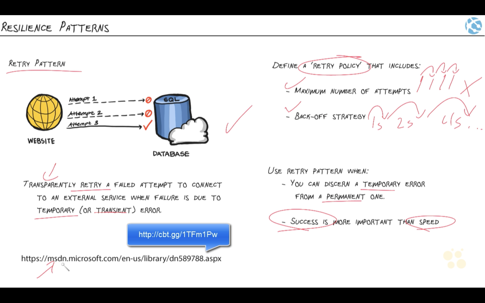
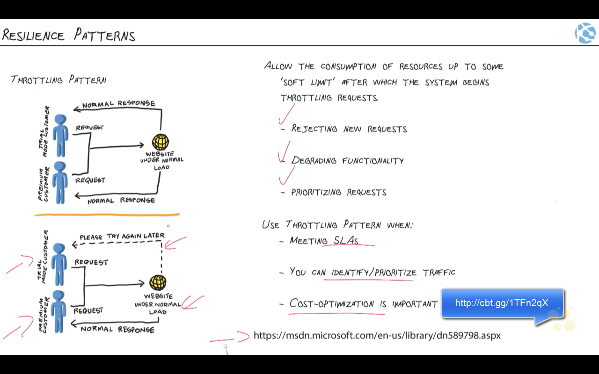
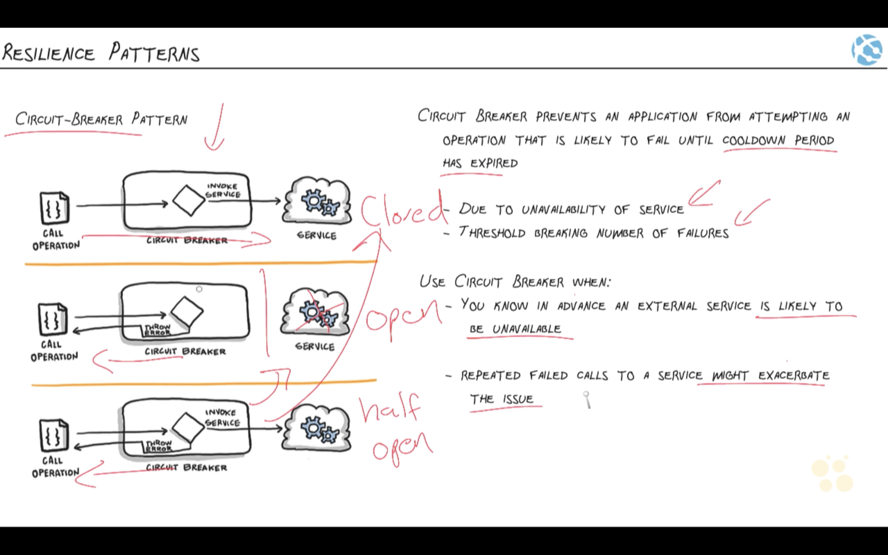
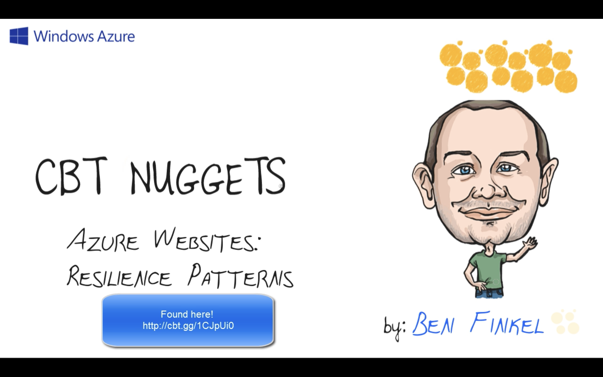

#### 10. Resilience Patterns

###### [Cloud Design Patterns](https://docs.microsoft.com/en-us/azure/architecture/patterns/)

- [Retry pattern](https://docs.microsoft.com/en-us/azure/architecture/patterns/retry)
- [Circuit Breaker pattern](https://docs.microsoft.com/en-us/azure/architecture/patterns/circuit-breaker)
- [Throttling pattern](https://docs.microsoft.com/en-us/azure/architecture/patterns/throttling)