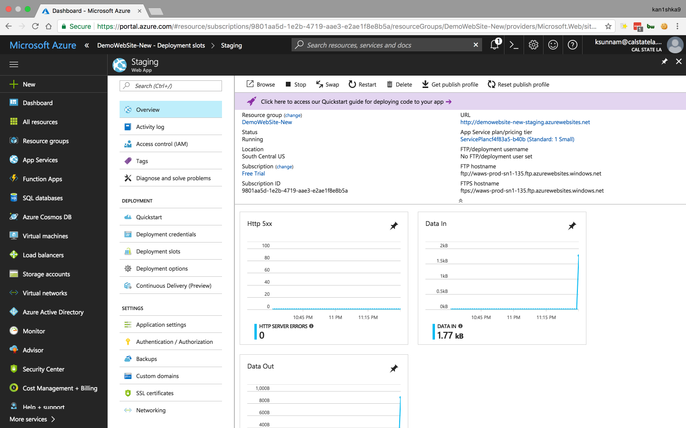
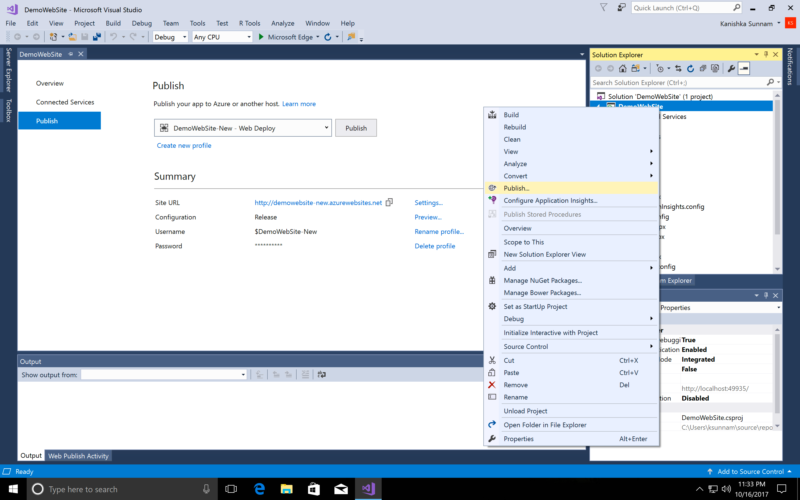

#### 2. Deployment Slots








- Commands

```PowerShell
Add-AzureAccount
Get-AzureSubscription
New-AzureWebsite -Name "DemoWebSite-New" -Slot "uat"
Switch-AzureWebsiteSlot -Name "DemoWebSite-New" -Slot1 "staging" -Slot2 "uat"
```