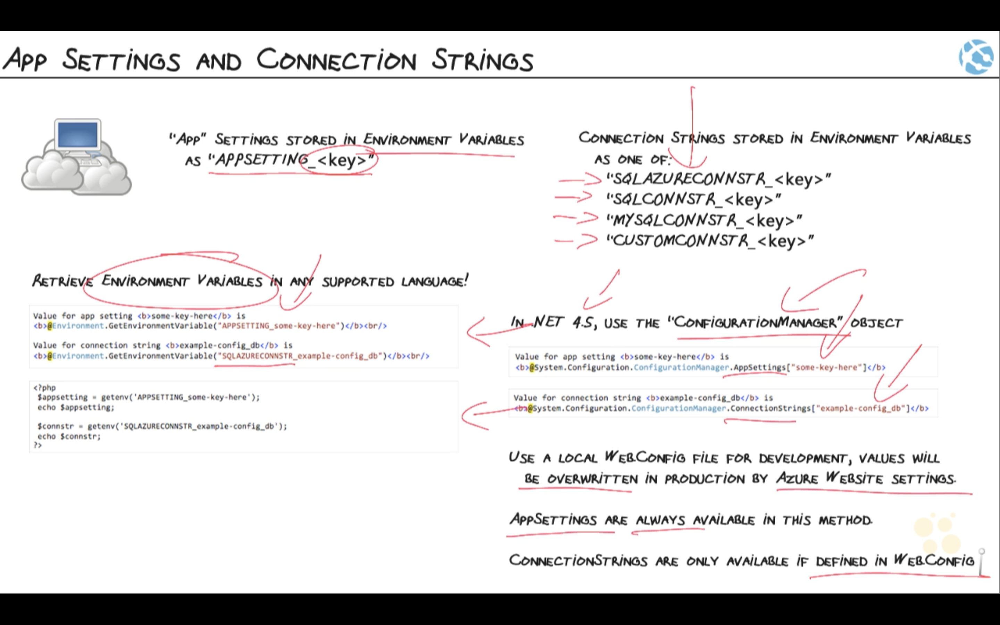
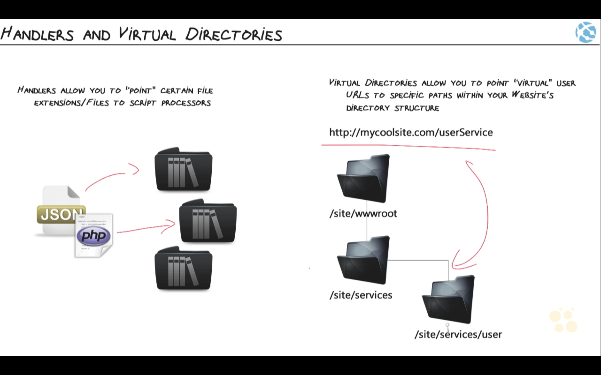
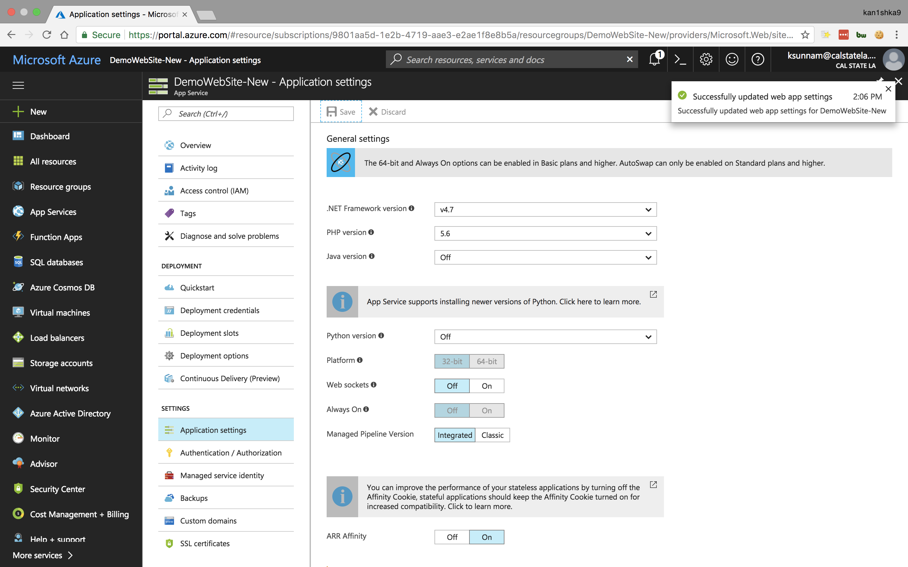

#### 4. Site Settings










- Extract azure site settings

```
@Environment.GetEnvironmentVariable("APPSETTING_MyAppVariable")
@Environment.GetEnvironmentVariable("SQLAZURECONNSTR_MyConnStr")
```

- Extract local site settings

```
@System.Configuration.ConfigurationManager.AppSettings["MyAppVariable"]
@System.Configuration.ConfigurationManager.ConnectionStrings["MyConnStr"]
```